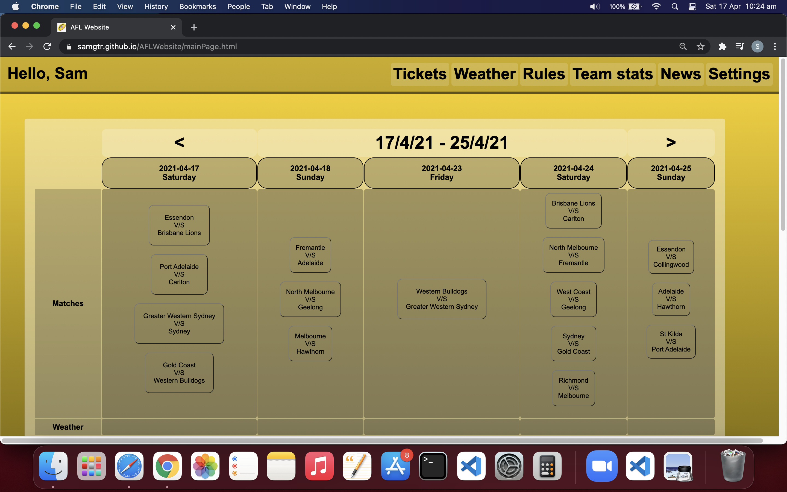

# AFLWebsite
This application is developed as Group Project-1 requirement.
Website for accessing information regarding Australian Rules Football League.

# Motivation
To create an easy to use website with information regarding the great game, Australian Rules Football.

# User Story
I want to know more about AFL, I want to know what games are on, where they’re being played as well as other details. I am new to the sport and have not yet learnt the rules or the theme song for the team I have chosen to follow. 

# Features
AFL website with dynamic styling, containing features including:
* Match details
* Weather
* Tickets
* Rules
* Team Stats
* Team Song
* News Link
* Team Specific Styling

# Screenshots

\

